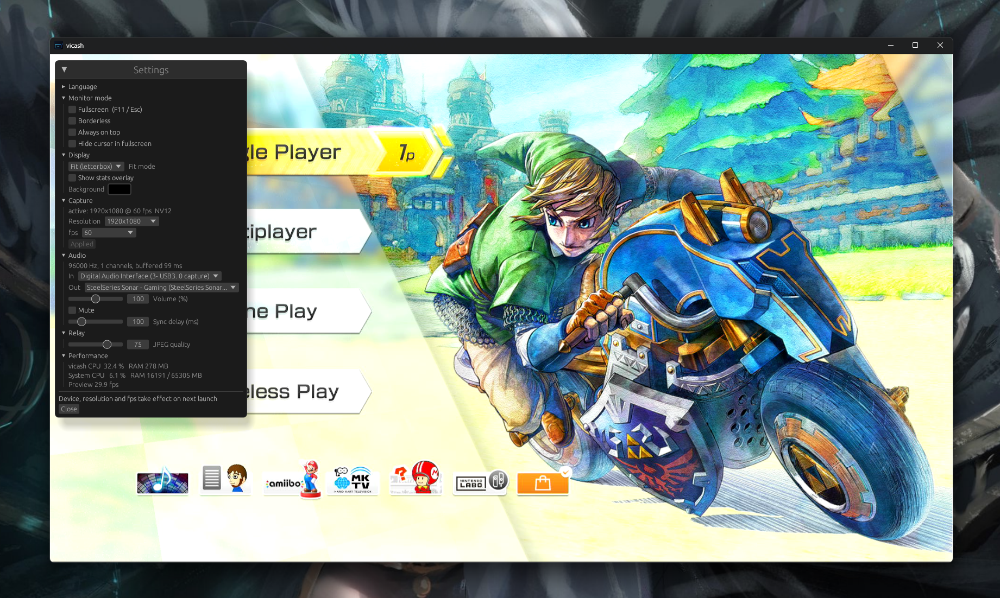
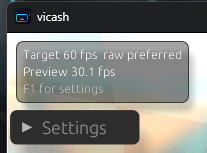
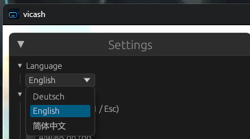

# vicash

Low overhead capture card preview window for streamers on low end or workaround setups. VIdeo CApture SHare.

vicash turns your capture card into a second monitor for your console. GPU rendered preview, audio passthrough with adjustable sync delay, and an optional MJPEG over HTTP relay so a second PC can pull the feed as a browser source.



## What it is

If you stream a console (Switch, PS, Xbox) through an HDMI splitter into a budget capture card, the standard tools cost you frames. OBS preview alone eats real CPU, and adding a second PC usually means buying another capture card. vicash solves both without extra hardware:

1. A direct, low latency preview window. wgpu textured quad, draws only when a new frame arrives so GPU and CPU sit idle the rest of the time. Press F11 to make the window your console's monitor.
2. Audio passthrough from the capture card's audio input to your default output device, with a live sync delay slider in case the picture lags the sound.
3. Optional MJPEG over HTTP relay so a second PC or another OBS instance can pull the feed over your LAN as a browser source.

Built for the case where every CPU percent matters.

<table>
<tr>
<td></td>
<td></td>
</tr>
</table>

## Features

- GPU rendered preview, redraws only when capture publishes a new frame
- Borderless fullscreen + always on top (F11) so vicash works as a real second monitor for a console
- Audio passthrough from the capture card's audio device to the default output, with live volume, mute and sync delay
- Live device switching from the F1 panel: pick audio input, audio output, capture resolution and fps without restart
- Persisted settings: vicash remembers your last device, resolution, fps, audio device, volume, sync delay, window mode, etc.
- Three UI languages: Deutsch, English, 简体中文
- Performance dashboard inside the F1 panel
- Optional MJPEG HTTP relay for browser / OBS browser source

## Non goals

- Replacing OBS. vicash does not encode, composite, or stream to Twitch.
- Fancy effects, overlays, scenes, or transitions.

## Status

Early development. Targeting Windows first because that is where capture cards live.

## Build

Requires a Rust toolchain (stable). On Windows you also need either the MSVC build tools or the GNU toolchain (`rustup default stable-x86_64-pc-windows-gnu`) with MinGW-w64 on PATH so `windres.exe` can compile the embedded icon resource.

```
cargo build --release
```

The binary lands at `target/release/vicash.exe`.

## Run

```
vicash.exe                                    # interactive device picker
vicash.exe --list                             # list video devices and exit
vicash.exe --list-audio                       # list audio devices and exit
vicash.exe --device 0                         # open device 0 in a preview window
vicash.exe --device 0 --audio                 # also pass audio through to default output
vicash.exe --device 0 --serve 0.0.0.0:8080    # also serve MJPEG over HTTP
```

Inside the preview window:

- `F1` opens the settings panel
- `F11` toggles borderless fullscreen
- `Esc` always leaves fullscreen
- All settings are live; resolution and fps changes restart the capture quickly

In OBS on the second PC, add a Browser source pointed at `http://<host>:8080/`.

## Configuration

Settings persist to `%APPDATA%\caaatto\vicash\config.toml` and reload on the next launch. CLI flags override the config on a per-flag basis.

## License

MIT. The bundled JetBrains Mono font is under the SIL Open Font License 1.1 (see `assets/JetBrainsMono-OFL.txt`).
